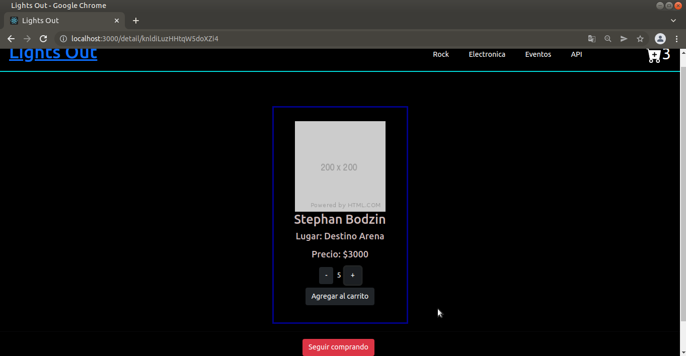
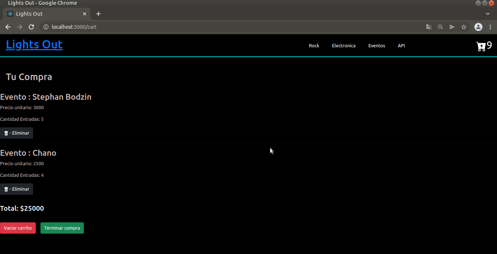

## Sitio Web de Venta de entradas realizado en React 

-Sitio web creado para el curso de React Js en Coderhouse.
-4º curso de la capacitacion FullStack de Technisys Bootcamp. 

## Construido con:

-React
-Css 
-Boostrap 
-Firebase

## Capturas:

> Home View
## --

> Item Detail View
## --

> Resumen Compra